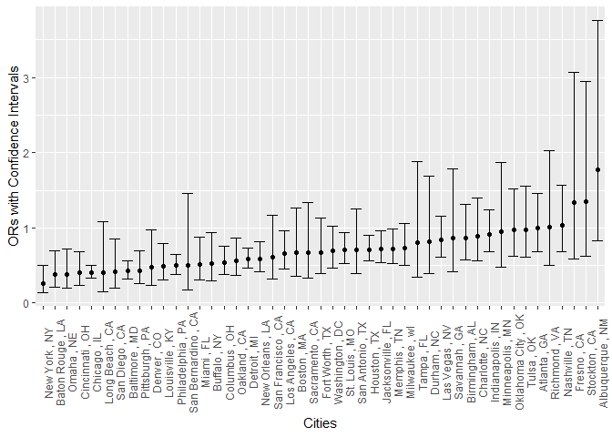
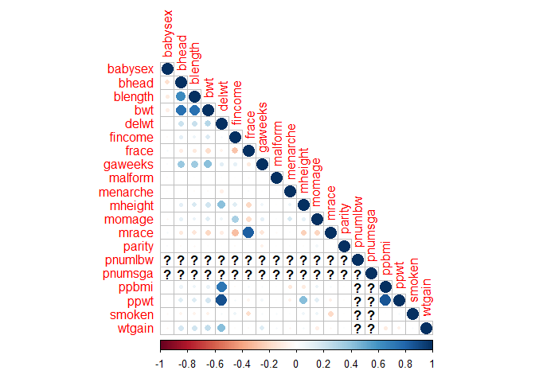
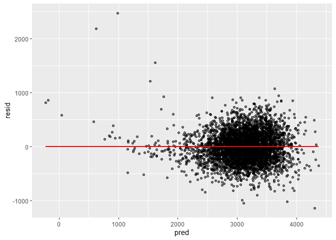
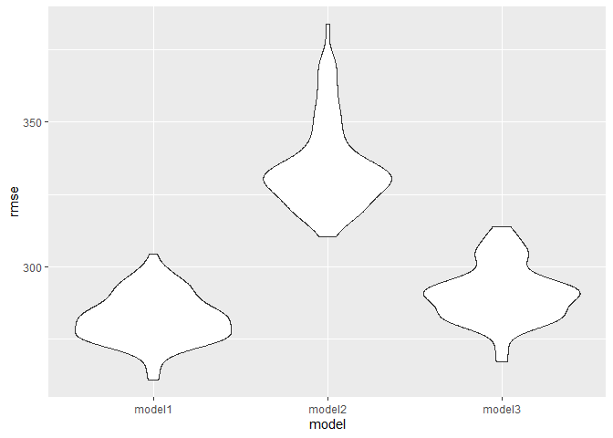

p8105_hw6_zl3263
================
2022-12-03

### Problem 2

``` r
library(tidyverse)
```

    ## ── Attaching packages ─────────────────────────────────────── tidyverse 1.3.2 ──
    ## ✔ ggplot2 3.3.6      ✔ purrr   0.3.4 
    ## ✔ tibble  3.1.8      ✔ dplyr   1.0.10
    ## ✔ tidyr   1.2.0      ✔ stringr 1.4.1 
    ## ✔ readr   2.1.2      ✔ forcats 0.5.2 
    ## ── Conflicts ────────────────────────────────────────── tidyverse_conflicts() ──
    ## ✖ dplyr::filter() masks stats::filter()
    ## ✖ dplyr::lag()    masks stats::lag()

``` r
library(corrplot)
```

    ## Warning: 程辑包'corrplot'是用R版本4.2.2 来建造的

    ## corrplot 0.92 loaded

``` r
library(modelr)
```

**load data**

``` r
homicides = read_csv("https://raw.githubusercontent.com/washingtonpost/data-homicides/master/homicide-data.csv")%>%
   janitor::clean_names() %>%
   mutate(
    city_state = paste(city,",",state)
  ) %>%
  filter(
    victim_race != "Unknown",
    city_state != "Tulsa , AL",
    victim_age != "Unknown",
    victim_sex != "Unknown"
    
  ) %>%
  mutate(
    victim_age = as.numeric(victim_age)
  ) 
```

    ## Rows: 52179 Columns: 12
    ## ── Column specification ────────────────────────────────────────────────────────
    ## Delimiter: ","
    ## chr (9): uid, victim_last, victim_first, victim_race, victim_age, victim_sex...
    ## dbl (3): reported_date, lat, lon
    ## 
    ## ℹ Use `spec()` to retrieve the full column specification for this data.
    ## ℹ Specify the column types or set `show_col_types = FALSE` to quiet this message.

**modeling on baltimore**

``` r
baltimore = homicides %>%
  filter(
    victim_race == "Black" | victim_race == "White",
    city_state == 'Baltimore , MD',
  ) %>%
  mutate(
    resolved = as.numeric(disposition == "Closed by arrest")
  )

model_logistic = glm(resolved ~ victim_age + victim_sex + victim_race, data = baltimore, family = binomial() )

model_logistic %>% 
  broom::tidy() %>% 
  mutate(
    OR = exp(estimate),
    CI_lower = exp(estimate - 1.96 * std.error),
    CI_upper = exp(estimate + 1.96 * std.error)
  ) %>%
  select(term, estimate, CI_lower, CI_upper, OR)
```

    ## # A tibble: 4 × 5
    ##   term             estimate CI_lower CI_upper    OR
    ##   <chr>               <dbl>    <dbl>    <dbl> <dbl>
    ## 1 (Intercept)       0.310      0.975    1.91  1.36 
    ## 2 victim_age       -0.00673    0.987    1.00  0.993
    ## 3 victim_sexMale   -0.854      0.325    0.558 0.426
    ## 4 victim_raceWhite  0.842      1.65     3.27  2.32

**modeling on each city**

``` r
fit_others = homicides %>%
  filter(
    victim_race == "Black" | victim_race == "White",
  ) %>%
  mutate(
    resolved = as.numeric(disposition == "Closed by arrest")
  ) %>%
  nest(nested = -city_state) %>% 
  mutate(
    models = map(.x = nested, ~glm(resolved ~ victim_age + victim_sex + victim_race, data = .x, family = binomial())),
    outputs = map(models, broom::tidy)
    ) %>%
  select(city_state, outputs) %>% 
  unnest(outputs) %>% 
  mutate(
    OR = exp(estimate),
    CI_lower = exp(estimate - 1.96 * std.error),
    CI_upper = exp(estimate + 1.96 * std.error)
  ) %>% 
  select(city_state, term, estimate, CI_lower, CI_upper, OR) %>%
  filter(
    term == "victim_sexMale"
  )

fit_others %>%
  head() %>%
  knitr::kable(digits = 3)
```

| city_state       | term           | estimate | CI_lower | CI_upper |    OR |
|:-----------------|:---------------|---------:|---------:|---------:|------:|
| Albuquerque , NM | victim_sexMale |    0.570 |    0.831 |    3.761 | 1.767 |
| Atlanta , GA     | victim_sexMale |    0.000 |    0.684 |    1.463 | 1.000 |
| Baltimore , MD   | victim_sexMale |   -0.854 |    0.325 |    0.558 | 0.426 |
| Baton Rouge , LA | victim_sexMale |   -0.964 |    0.209 |    0.695 | 0.381 |
| Birmingham , AL  | victim_sexMale |   -0.139 |    0.574 |    1.318 | 0.870 |
| Boston , MA      | victim_sexMale |   -0.404 |    0.354 |    1.260 | 0.667 |

**plot**

``` r
fit_others %>%
  ggplot(aes(x = reorder(city_state, OR), y = OR)) +
      geom_point() +
      geom_errorbar(aes(ymin = CI_lower, ymax = CI_upper)) +
      labs(
        x = "Cities",
        y = "ORs with Confidence Intervals",
      ) +
      theme(
        axis.text.x = element_text(angle = 90)
      )
```

<!-- -->

**comments**

In most of the cities, homicides in which the victim is male are less
likely to be resolved than those in which the victim is female. But for
cities after Atlanta shown on the plot above, homicides with female
victim are less likely to be resolved.

### Problem 3

**load and clean the data**

``` r
birth_weight = read_csv("https://p8105.com/data/birthweight.csv") %>%
  janitor::clean_names() %>%
  filter(
    frace < 8,
    mrace < 8
  ) %>%
  mutate(
    babysex = as.factor(babysex),
    frace = as.factor(frace),
    mrace = as.factor(mrace),
    malform = as.factor(malform)
  ) 
```

    ## Rows: 4342 Columns: 20
    ## ── Column specification ────────────────────────────────────────────────────────
    ## Delimiter: ","
    ## dbl (20): babysex, bhead, blength, bwt, delwt, fincome, frace, gaweeks, malf...
    ## 
    ## ℹ Use `spec()` to retrieve the full column specification for this data.
    ## ℹ Specify the column types or set `show_col_types = FALSE` to quiet this message.

``` r
head(birth_weight)  
```

    ## # A tibble: 6 × 20
    ##   babysex bhead blength   bwt delwt fincome frace gaweeks malform menarche
    ##   <fct>   <dbl>   <dbl> <dbl> <dbl>   <dbl> <fct>   <dbl> <fct>      <dbl>
    ## 1 2          34      51  3629   177      35 1        39.9 0             13
    ## 2 1          34      48  3062   156      65 2        25.9 0             14
    ## 3 2          36      50  3345   148      85 1        39.9 0             12
    ## 4 1          34      52  3062   157      55 1        40   0             14
    ## 5 2          34      52  3374   156       5 1        41.6 0             13
    ## 6 1          33      52  3374   129      55 1        40.7 0             12
    ## # … with 10 more variables: mheight <dbl>, momage <dbl>, mrace <fct>,
    ## #   parity <dbl>, pnumlbw <dbl>, pnumsga <dbl>, ppbmi <dbl>, ppwt <dbl>,
    ## #   smoken <dbl>, wtgain <dbl>

**trying to select varaibles**

``` r
read_csv("https://p8105.com/data/birthweight.csv") %>% 
  cor() %>%
  corrplot(,type = "lower")
```

    ## Rows: 4342 Columns: 20
    ## ── Column specification ────────────────────────────────────────────────────────
    ## Delimiter: ","
    ## dbl (20): babysex, bhead, blength, bwt, delwt, fincome, frace, gaweeks, malf...
    ## 
    ## ℹ Use `spec()` to retrieve the full column specification for this data.
    ## ℹ Specify the column types or set `show_col_types = FALSE` to quiet this message.

    ## Warning in cor(.): 标准差为零

<!-- -->

I choose 3 variables that have highest correlation coefficient with
`bwt`, since they all positively related, I also add a negatively
related variable to my model.

**model 1**

``` r
model1 = lm(bwt ~ bhead + blength + gaweeks + mrace, data = birth_weight)

birth_weight %>% 
  add_residuals(model1) %>%
  add_predictions(model1) %>% 
  ggplot(aes(x = pred, y = resid)) + 
  geom_point(alpha = 0.5) +
  geom_smooth(se = F, color = "red", method = "lm")
```

    ## `geom_smooth()` using formula 'y ~ x'

<!-- -->

``` r
model2 = lm(bwt ~ blength + gaweeks, data = birth_weight) 

model3 = lm(bwt ~ bhead + blength + babysex + bhead:blength + blength:babysex + bhead:babysex + bhead:blength:babysex, data = birth_weight) 
```

**cross validation**

``` r
cv_df = 
  crossv_mc(birth_weight, 100) 

cv_df =
  cv_df %>% 
  mutate(
    train = map(train, as_tibble),
    test = map(test, as_tibble))

cv_df = 
  cv_df %>% 
  mutate(
    model1  = map(train, ~lm(bwt ~ bhead + blength + gaweeks + mrace, data = .x)),
    model2  = map(train, ~lm(bwt ~ blength + gaweeks, data = .x)),
    model3  = map(train, ~lm(bwt ~ bhead + blength + babysex + bhead:blength + blength:babysex + bhead:babysex + bhead:blength:babysex, data = .x))
    ) %>% 
  mutate(
    rmse_model1 = map2_dbl(model1, test, ~rmse(model = .x, data = .y)),
    rmse_model2 = map2_dbl(model2, test, ~rmse(model = .x, data = .y)),
    rmse_model3 = map2_dbl(model3, test, ~rmse(model = .x, data = .y))
    )

cv_df %>% 
  select(starts_with("rmse")) %>% 
  pivot_longer(
    everything(),
    names_to = "model", 
    values_to = "rmse",
    names_prefix = "rmse_") %>% 
  mutate(model = fct_inorder(model)) %>% 
  ggplot(aes(x = model, y = rmse)) + geom_violin()
```

<!-- -->

According to the plot, model 3 and model 1 have better performance than
model 2.
